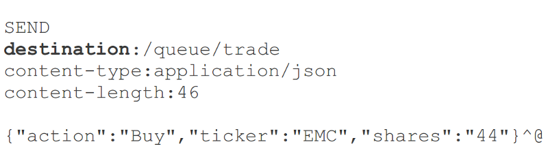

!SLIDE subsection
# STOMP

!SLIDE smaller bullets incremental
# [STOMP Protocol](http://stomp.github.io/index.html)

* Simple protocol for asynchronous message passing
* Originally for scripting languages (Ruby, Python)
* Supported by message brokers
* Suited for use on the web
* Frames modelled on HTTP

!SLIDE smaller center
# STOMP Frame Content
 

!SLIDE smaller bullets incremental
# Client-to-Server Commands

* `SEND`
* `SUBSCRIBE`
* `UNSUBSCRIBE`

!SLIDE smaller bullets incremental
# Server-to-Client Commands

* `MESSAGE`
* `ERROR`
* `RECEIPT`
* `ACK`
* `NACK`

!SLIDE smaller bullets incremental
# The `"Destination"` Header

* A key concept in STOMP
* Opaque string, syntax left to server
* Typically URI path-like (`"/queue/a"`, `"/topic/a"`)
* Message brokers define semantics

!SLIDE smaller center
# Client Produces a Message
 

!SLIDE smaller center
# Client Consumes a Message (1)
 

!SLIDE smaller center
# Client Consumes a Message (2)
 

!SLIDE smaller bullets incremental
# STOMP vs Raw WebSocket

* Standard message format
* Browser client support (e.g. [stomp.js](https://github.com/jmesnil/stomp-websocket), [msgs.js](https://github.com/cujojs/msgs))
* Common messaging patterns
* Ability to incorporate (full-featured) message broker

