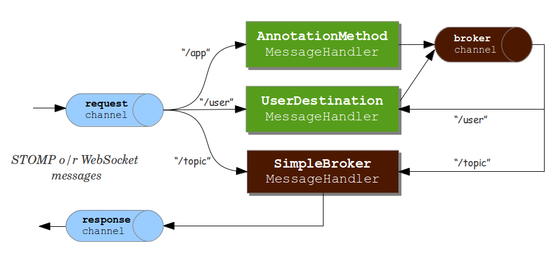

!SLIDE subsection
# User Information

!SLIDE smaller bullets incremental
# Authentication

* STOMP `CONNECT` frame has authentication headers
* Over WebSocket we can use HTTP
* Protect application as usual, e.g. Spring Security
* Messages enriched with "user" header

!SLIDE smaller
# Access to User Information

    @@@ java

    @Controller
    public class GreetingController {

      @MessageMapping("/greeting")
      @SendTo("/topic/greetings")
      public String greet(String greeting, Principal user) {
          return "[" + user + "] says: " + greeting;
      }

    }

!SLIDE smaller 
# Report Error to User

    @@@ java

    @Controller
    public class GreetingController {

      // ...

      @MessageExceptionHandler
      @SendToUser("/queue/errors")
      public String handleException(IllegalStateException ex) {
        return ex.getMessage();
      }

    }

!SLIDE smaller
# Send Async Results To User

    @@@ java
    @Service
    public class TradeService {

      @Autowired
      private SimpMessagingTemplate template;

      public void executeTrade(Trade trade) {

        String user = trade.getUser();
        String dest = "/queue/position-updates";
        TradeResult result = ...

        this.template.convertAndSendToUser(user, dest, result);
      }

    }

!SLIDE smaller bullets incremental
# How "SendToUser" Works
## _(server side)_
  
* When you use `@SendToUser("/queue/a")`
* Resulting destination is `"/user/{user}/queue/a"`
* This is resolved to `"/queue/a/"` + `unique queue-suffix`
* and then sent to broker channel

!SLIDE smaller bullets incremental
# How Send-To-User Works
## _(client side)_
  
* Client subscribes to queue with unique name suffix
* STOMP `CONNECTED` frame provides that suffix
* as well as current user name

!SLIDE small center
# Message Flow
 

!SLIDE smaller bullets incremental
# Managing Inactive Queues
## _(full-featured brokers)_
  
* Check broker documentation
* For example RabbitMQ creates auto-delete queue with destinations like `"/exchange/amq.direct/a"`
* ActiveMQ has [config options](http://activemq.apache.org/delete-inactive-destinations.html) to purge inactive destinations

